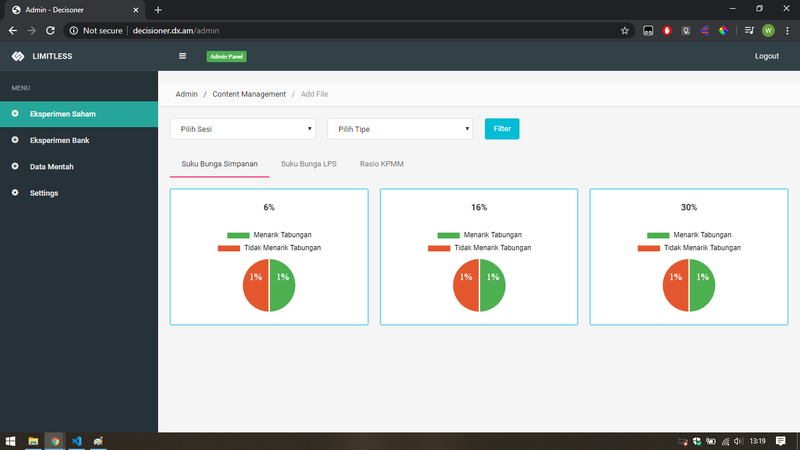
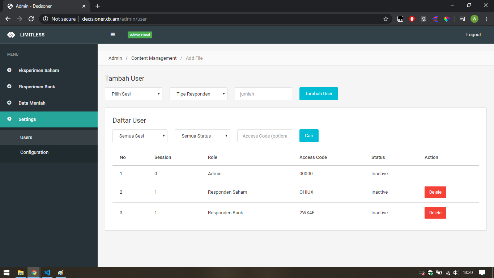
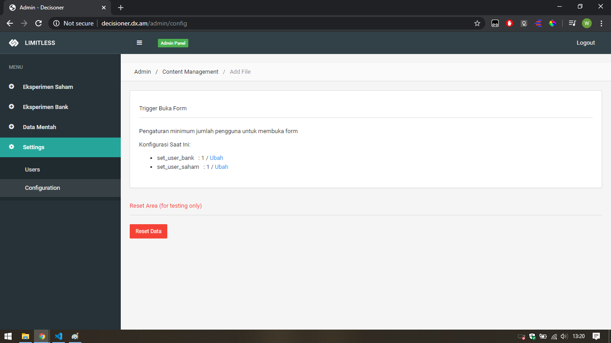

# decisioner
decision questionnaire - Sistem bantu analisa relasi kepanikan pada perbankan terhadap keputusan pemegang saham

Merupakan sistem yang mampu membantu stakeholder untuk menganalisa apakah ada relasi antara keputusan pemegang saham dengan kepanikan yang terjadi di perbankan. Pengambilan data dari Responden dilakukan dengan melakukan beberapa skenario modifikasi Tingkat Suku Bunga Simpanan, Suku Bunga LPS, Rasio KPMM, serta adanya Referensi yang dimunculkan. Ini bertujuan untuk mengetahui kepanikan yang terjadi dengan adanya berbagai perubahan yang ada

>Status : [x] Done

>Spesifikasi Sistem
* Login untuk membatasi hak akses tiap-tiap kelompok responden
* Mampu menampilkan kuesioner dengan berbagai skenario
* Menampilkan nilai dan grafik yang mampu mendukung analisa
* Grafik Realtime

>Framework
* Bootstrap
* Codeigniter
* MySQL

>Tampilan Halaman Admin

>Demo Web
* http://decisioner.dx.am/
* *contacs me via email win.oktia@gmail.com for demo access request*
